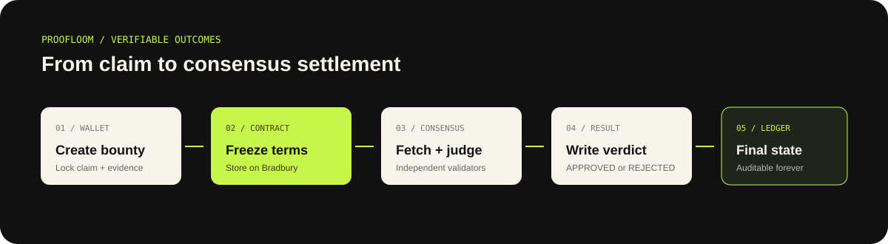
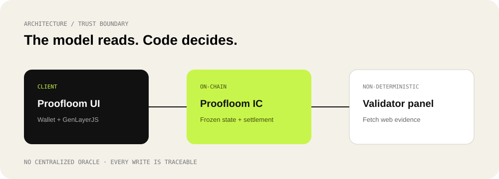

# Proofloom

### Proof-powered public outcomes on GenLayer

Proofloom turns a public claim into a verifiable, on-chain workflow. A creator locks a claim and evidence URL, independent GenLayer validators fetch the source, and the Intelligent Contract stores consensus.

[Live app](https://proofloom-amber.vercel.app/) · [Bradbury contract](https://explorer-bradbury.genlayer.com/address/0x503E36cf90C6B3Ed888C26f835250A27D0c5d83b) · [Deployment record](docs/DEPLOYMENT.md)



## Why GenLayer

The important question is not whether a backend says a page is valid, but whether independent validators fetched and agreed on what it says. Proofloom places that question inside a GenLayer consensus transaction. The model produces a constrained boolean; deterministic contract code writes `APPROVED` or `REJECTED`.

## Product workflow

1. **Connect** — the browser wallet switches to GenLayer Bradbury (`4221`).
2. **Create** — `create_bounty(claim, evidence_url)` writes an `OPEN` bounty.
3. **Investigate** — `verify_bounty(id)` makes validators render the evidence URL and judge it against the frozen claim.
4. **Agree** — `gl.eq_principle.strict_eq` requires the settlement result to match.
5. **Read** — the UI calls `get_bounty(id)` and displays durable on-chain state.



## Trust boundary

| Layer | Responsibility |
| --- | --- |
| Wallet + UI | Collect intent, sign writes, wait for finalization |
| GenLayer IC | Freeze claims, fetch evidence under consensus, persist status |
| Validators | Independently render public evidence and return constrained readings |
| Deterministic code | Convert consensus result into stored status |

No private API key, centralized oracle, or client-side verdict is trusted for settlement.

## Contract surface

| Method | Type | Purpose |
| --- | --- | --- |
| `create_bounty` | write | Store a claim and HTTPS evidence URL |
| `verify_bounty` | consensus write | Fetch, judge, and persist `APPROVED`/`REJECTED` |
| `get_bounty` | view | Read a complete bounty record |
| `get_stats` | view | Read total and approved counts |

Source: [`contracts/proofloom.py`](contracts/proofloom.py)

## Deployment

| Item | Value |
| --- | --- |
| Network | GenLayer Bradbury Testnet |
| Chain ID | `4221` |
| RPC | `https://rpc-bradbury.genlayer.com` |
| Contract | `0x503E36cf90C6B3Ed888C26f835250A27D0c5d83b` |
| Deployment tx | `0x4f3100a7be2e77f09224b87912e4eac1cf510e19c2b1145e390ee76a267ea149` |

The deployment finalized with `AGREE` and `FINISHED_WITH_RETURN`. Full details: [`docs/DEPLOYMENT.md`](docs/DEPLOYMENT.md).

## Repository map

```text
contracts/proofloom.py       GenLayer Intelligent Contract
frontend/src/                Typed GenLayerJS client reference
web/                         Deployed wallet-connected UI
tests/                       Deterministic regression tests
.github/workflows/ci.yml     Compile, test, and frontend checks
docs/                        Workflow, architecture, deployment proof
```

## Run locally

```powershell
cd web
python -m http.server 4173
```

Open `http://localhost:4173`. Connect a wallet on Bradbury and use the configured production contract address.

## Verify before shipping

```powershell
python -m unittest discover -s tests -v
node --check web/app.js
node --check web/wallet.js
genvm-lint check contracts/proofloom.py --json
```

## Security notes

- Evidence URLs must be HTTPS.
- The contract never accepts a client-provided verdict.
- Wallet writes are fee-estimated and finalized before success is shown.
- Testnet GEN has no implied monetary value.

## Status

Proofloom is a working Bradbury builder project: deployed contract, real GenLayer consensus path, browser wallet integration, verifiable deployment record, CI checks, and a production Vercel frontend.
